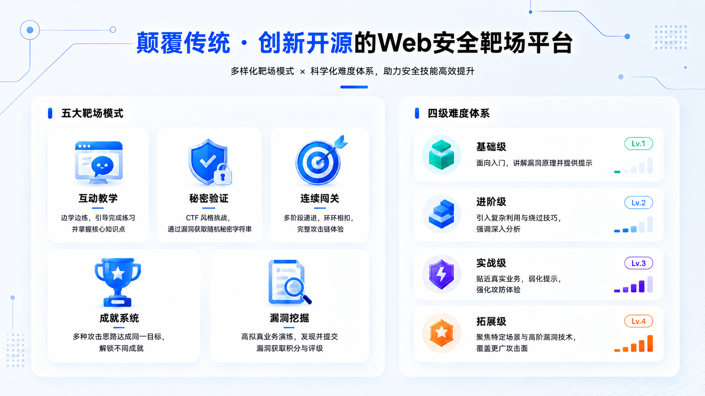
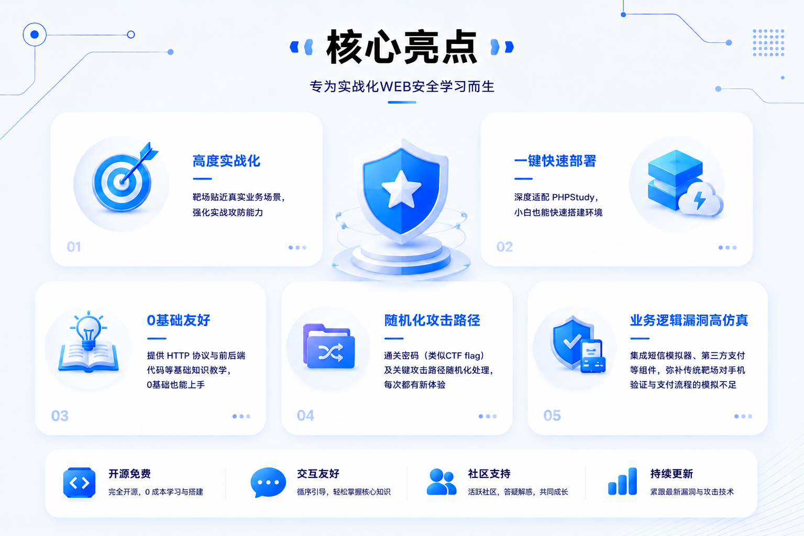

<div align="center">


# 天积安全WEB靶场平台

**日积寸功，乐享安全**

[](LICENSE)
[](https://php.net)
[](https://mysql.com)
[](https://httpd.apache.org)

</div>

---

## 简介

**天积安全 WEB 靶场平台**是一款面向零基础用户的开源网络安全学习平台，借助AI完成了对传统开源WEB安全靶场的颠覆式创新，体系化构建了从 HTTP 协议基础到业务逻辑漏洞的完整WEB安全学习路径，通过一系列循序渐进的实战练习帮助你体系化掌握 WEB 安全技能。

平台由80+独立的WEB靶场组成，你可以按顺序或者根据兴趣自由选择学习路径，平台会自动记录学习进度。
<p align="center">

</p>
平台的靶场在设计时尽可能将漏洞与真实的业务场景融合，带来更加实战化的体验，同时也以游戏化的方式设计了多种任务机制，让学习过程更加有趣。


<p align="center">

</p>

## 功能亮点
### 靶场特色

<p align="center">

</p>

### 核心亮点

<p align="center">

</p>


## 靶场覆盖

平台共包含 **4 大分类、85 个靶场**，覆盖 WEB 安全核心知识体系：

<table>
<tr><th>一级分类</th><th>二级分类</th><th>数量</th><th>靶场列表</th></tr>
<tr><td rowspan="3" align="center"><strong>WEB安全基础知识</strong></td>
<td>HTTP协议基础</td><td align="center">6</td><td>HTTP协议解析、Accept-Language、User-Agent、Cookie、代理IP请求头、CRLF注入</td></tr>
<tr><td>网站前端代码基础</td><td align="center">4</td><td>HTML语言基础、HTML前端校验绕过、JavaScript基础、JavaScript绕过</td></tr>
<tr><td>服务端语言基础</td><td align="center">6</td><td>PHP/SQL基础、暴力破解、目录浏览、路径穿越、URL任意跳转、SSRF</td></tr>
<tr><td rowspan="6" align="center"><strong>输入验证类漏洞</strong></td>
<td>文件上传</td><td align="center">11</td><td>前端校验/黑名单/白名单/Content-Type/JS校验/多文件上传、文件头校验/WAF对抗、目录权限绕过/条件竞争/综合对抗</td></tr>
<tr><td>跨站脚本注入 (XSS)</td><td align="center">8</td><td>XSS基础分类、注入Script标签、标签与事件、HTML属性注入、JS上下文逃逸、文件XSS、XSS实战利用、XSS+CSRF</td></tr>
<tr><td>命令执行 (RCE)</td><td align="center">6</td><td>回显/无回显命令注入、代码注入、文件包含基础/进阶、命令执行实战</td></tr>
<tr><td>SQL注入</td><td align="center">11</td><td>SQL注入基础/练习、盲注/报错注入/时间盲注、不同语句注入、特殊字符/关键字过滤绕过、盲注进阶、特殊SQL注入、综合实战</td></tr>
<tr><td>XML相关漏洞</td><td align="center">3</td><td>XXE基础、XXE绕过、SOAP与XML</td></tr>
<tr><td>反序列化</td><td align="center">3</td><td>反序列化基础、反序列化练习、反序列化实战</td></tr>
<tr><td rowspan="3" align="center"><strong>业务逻辑类漏洞</strong></td>
<td>绕过验证</td><td align="center">16</td><td>基础流程绕过、图片验证码绕过×2、短信验证码绕过、用户枚举、会话安全、密码重置绕过×3、批量注册、用户覆盖、前端加密爆破、JWT基础/漏洞/算法绕过/密钥注入</td></tr>
<tr><td>越权访问</td><td align="center">5</td><td>水平越权、垂直越权、未授权访问、文件越权、综合实战</td></tr>
<tr><td>交易篡改</td><td align="center">5</td><td>金额篡改、异常数据、重放攻击、三方支付漏洞、优惠滥用</td></tr>
<tr><td align="center"><strong>综合实战</strong></td>
<td>—</td><td align="center">1</td><td>商城系统综合实战</td></tr>
</table>

> 靶场持续更新中，关注微信公众号「天积安全」获取最新动态。

## 快速部署

### 环境要求

| 组件 | 推荐版本 |
|:---:|:---:|
| PHP | 7.3.4（版本过低可能无法运行，版本过高可能影响漏洞利用） |
| MySQL | 5.7+ |
| Apache | 2.4+ |
| 操作系统 | Windows(推荐) / Linux |

### 安装步骤（推荐 PHPStudy）

> 推荐使用 PHPStudy 集成环境快速部署，小白友好！

1. **下载 PHPStudy 集成环境**：[https://m.xp.cn/phpstudy](https://m.xp.cn/phpstudy)，下载 phpStudy v8.1版。
2. **安装 PHPStudy 集成环境**：双击安装包，按照提示进行安装，安装路径不要有中文字符避免奇怪的bug。
3. **启动服务器**：安装后双击打开PHPStudy集成环境的控制面板，鼠标在一键启动区域中的WNMP位置悬停，点击出现的切换按钮，将WEB服务改为Apache，然后在WNMP位置点击启动按钮启动服务。
4. **部署安装包**：点击左侧网站选项卡，找到物理路径位置，删掉目录下的所有文件，然后将本靶场的所有源码文件放到该目录下。（通常你会将本靶场的源码以zip包的形式下载，解压后放到物理路径目录下即可）
5. **访问靶场**：打开浏览器，输入 `http://localhost/` 即可访问本靶场，首次访问时会自动弹出初始化数据库的提示，点击确认即可。（数据库配置默认适配本地PHPStudy集成环境的数据库，无需额外配置）


<summary>📖 数据库配置详情</summary>

- 数据库配置文件位于 `config/config.php`，默认适配本地 PHPStudy 环境
- 首次访问自动提示初始化数据库，无需手动创建
- 前台页面右上角支持一键重置数据库，可按需勾选是否重置靶场数据和进度
- 数据库前缀：`heasec_`，`heasec_cms` 为前台数据库，其他为靶场数据库

### 安装步骤（Docker）

> 已安装 Docker 的用户可选择此方式，无需安装 PHPStudy。

1. **配置镜像加速器**（国内用户）：
   - **Windows**（Docker Desktop）：打开 Docker Desktop → Settings → Docker Engine，在 JSON 配置中添加 `registry-mirrors`：
     ```json
     { "registry-mirrors": ["https://docker.1ms.run", "https://docker.m.daocloud.io"] }
     ```
     保存并重启 Docker。
   - **Linux**：编辑或创建 `/etc/docker/daemon.json`，写入：
     ```json
     { "registry-mirrors": ["https://docker.1ms.run", "https://docker.m.daocloud.io"] }
     ```
     然后执行 `sudo systemctl restart docker` 重启服务。
2. **构建并启动**：在项目根目录（`docker-compose.yml` 所在目录）打开终端，执行：
   ```bash
   docker compose up -d --build
   ```
   首次构建需要编译 PHP 扩展，约 3-5 分钟；
   💡后续启动只需执行 `docker compose up -d`，无需再次构建。
3. **访问靶场**：打开浏览器访问 `http://localhost:8080/`，首次访问会自动提示初始化数据库。

<details>
<summary>📖 Docker 常用命令</summary>

```bash
# 启动（已构建过则不需要 --build）
docker compose up -d

# 停止
docker compose down

# 重置靶场（删除数据卷，下次 up 时恢复初始状态）
docker compose down -v

# 查看日志
docker compose logs -f

# 重新构建（修改代码后）
docker compose up -d --build
```
</details>


## 靶场使用指南

<summary>💡 使用提示</summary>

- 每个靶场**独立运行**，使用独立会话 ID（`HEASEC_RANGE_XXXX_SESSION`），靶场间互不干扰
- 每个靶场右上角有**重置按钮**，可将当前靶场重置为初始状态（不影响学习进度和其他靶场）
- 重置后通关密码等随机数据会改变
- 需要手机验证码的靶场，可使用右上角的**短信模拟器**模拟手机操作
- 除互动教学模式外，其他模式不提供具体操作步骤，请通过互联网或 AI 学习相关技术，或关注公众号获取攻略


## 开源许可证

[](LICENSE)

本项目基于 [GNU General Public License v3.0](LICENSE) 协议开源。

这意味着你可以自由地使用、修改和分发本项目，但衍生作品必须同样以 GPL-3.0 协议发布，且必须保留原始版权声明和协议声明。

```
天积安全 - 网络安全靶场系统
Copyright (C) 2026 天积安全 (HeavenlySecret)

This program is free software: you can redistribute it and/or modify
it under the terms of the GNU General Public License as published by
the Free Software Foundation, either version 3 of the License, or
(at your option) any later version.
```

## 联系我们

<p align="center">
<a href="https://gitee.com/HeaSec/">

</a>
<a href="https://github.com/HeaSec/">

</a>
</p>

- **Gitee**：[https://gitee.com/HeaSec/](https://gitee.com/HeaSec/)
- **GitHub**：[https://github.com/HeaSec/](https://github.com/HeaSec/)
- **核心成员**：WindFtsy · Vista_Ax · Lyan
- **微信公众号**：天积安全（关注后可加入微信群交流）

<p align="center">

</p>

<p align="center">
<i>关注公众号获取官方通关攻略与最新动态</i>
</p>

---

> **⚠️ 特别声明**
>
> 本平台为**开源网络安全训练环境**，仅供合法授权的安全学习、技术研究与攻防演练。**严禁**利用本平台及相关技术从事任何违法行为。
>
> **⚠️ 安全警告**：本平台代码**故意包含大量已知安全漏洞**，仅适合在本地隔离环境或严格访问控制的内部网络部署。**切勿直接部署于互联网**，否则极易导致服务器被非法入侵或滥用。因不当部署引发的安全事件及法律责任，由部署者自行承担，项目贡献者不承担任何责任。
